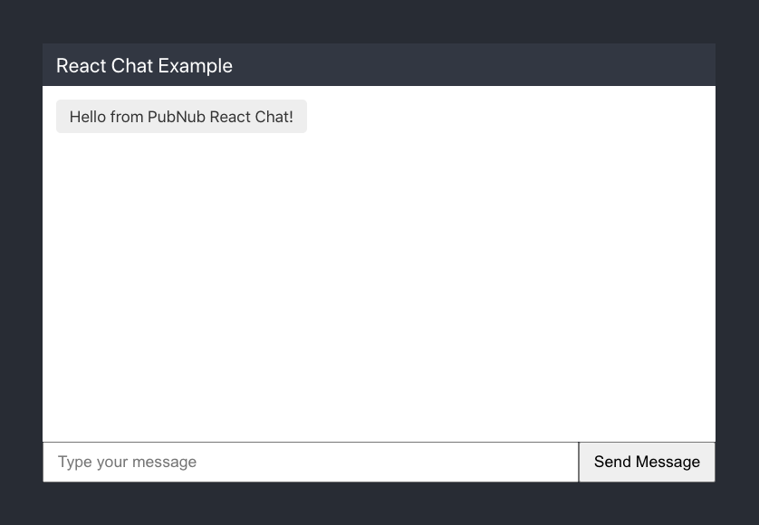

# WebPubSub React Framework

This is the official WebPubSub React framework repository.

WebPubSub takes care of the infrastructure and APIs needed for the realtime communication layer of your application. Work on your app's logic and let WebPubSub handle sending and receiving data across the world in less than 100ms.

* [Requirements](#requirements)
* [Get keys](#get-keys)
* [Sample app](#sample-app)
* [文档链接](#documentation-links)
* [Reference information](#reference-information)
* [支持](#support)

## Requirements

To use the WebPubSub React framework, you need:

* React 16.8 or above
* WebPubSub [Javascript SDK](https://www.webpubsub.com/docs/web-javascript/webpubsub-javascript-sdk).

> This library is compatible with the latest versions of the React Native framework. For examples, refer to [examples/reactnative](/examples/reactnative).

## Get keys

You will need publish and subscribe keys to authenticate your app. Get your keys from the [Admin Portal](https://dashboard.webpubsub.com/).

## Sample app

Follow these instructions to set up a simple chat app using WebPubSub.

**Note**: These instructions assume you're using JavaScript. If you'd prefer to use TypeScript, follow the instructions in the [React framework documentation](https://www.webpubsub.com/docs/chat/react/getting-started).

1. Set up your React project.

    For a quick single-page app, [create-react-app](https://reactjs.org/docs/create-a-new-react-app.html#create-react-app) is a good starting point:

    ```bash
    npx create-react-app react-sample-chat
    ```

1. Add the WebPubSub JavaScript SDK and React framework packages to your project:

    ```bash
    cd react-sample-chat
    npm install --save webpubsub-js webpubsub-react
    ```

1. Replace the contents of `src/App.js` with the following, replacing `myPublishKey` and `mySubscribeKey` with your own keys, and `myUniqueUUID` with a value of your choice:

    ```jsx
    import React, { useState, useEffect } from 'react';
    import WebPubSub from 'webpubsub';
    import { WebPubSubProvider, useWebPubSub } from 'webpubsub-react';

    const webpubsub = new WebPubSub({
      publishKey: 'myPublishKey',
      subscribeKey: 'mySubscribeKey',
      uuid: 'myUniqueUUID'
    });

    function App() {
      return (
        <WebPubSubProvider client={webpubsub}>
          <Chat />
        </WebPubSubProvider>
      );
    }

    function Chat() {
      const webpubsub = useWebPubSub();
      const [channels] = useState(['awesome-channel']);
      const [messages, addMessage] = useState([]);
      const [message, setMessage] = useState('');

      const handleMessage = event => {
        const message = event.message;
        if (typeof message === 'string' || message.hasOwnProperty('text')) {
          const text = message.text || message;
          addMessage(messages => [...messages, text]);
        }
      };

      const sendMessage = message => {
        if (message) {
          webpubsub
            .publish({ channel: channels[0], message })
            .then(() => setMessage(''));
        }
      };

      useEffect(() => {
        webpubsub.addListener({ message: handleMessage });
        webpubsub.subscribe({ channels });
      }, [webpubsub, channels]);

      return (
        <div style={pageStyles}>
          <div style={chatStyles}>
            <div style={headerStyles}>React Chat Example</div>
            <div style={listStyles}>
              {messages.map((message, index) => {
                return (
                  <div key={`message-${index}`} style={messageStyles}>
                    {message}
                  </div>
                );
              })}
            </div>
            <div style={footerStyles}>
              <input
                type="text"
                style={inputStyles}
                placeholder="Type your message"
                value={message}
                onKeyPress={e => {
                  if (e.key !== 'Enter') return;
                  sendMessage(message);
                }}
                onChange={e => setMessage(e.target.value)}
              />
              <button
                style={buttonStyles}
                onClick={e => {
                  e.preventDefault();
                  sendMessage(message);
                }}
              >
                Send Message
              </button>
            </div>
          </div>
        </div>
      );
    }

    const pageStyles = {
      alignItems: 'center',
      background: '#282c34',
      display: 'flex',
      justifyContent: 'center',
      minHeight: '100vh',
    };

    const chatStyles = {
      display: 'flex',
      flexDirection: 'column',
      height: '50vh',
      width: '50%',
    };

    const headerStyles = {
      background: '#323742',
      color: 'white',
      fontSize: '1.4rem',
      padding: '10px 15px',
    };

    const listStyles = {
      alignItems: 'flex-start',
      backgroundColor: 'white',
      display: 'flex',
      flexDirection: 'column',
      flexGrow: 1,
      overflow: 'auto',
      padding: '10px',
    };

    const messageStyles = {
      backgroundColor: '#eee',
      borderRadius: '5px',
      color: '#333',
      fontSize: '1.1rem',
      margin: '5px',
      padding: '8px 15px',
    };

    const footerStyles = {
      display: 'flex',
    };

    const inputStyles = {
      flexGrow: 1,
      fontSize: '1.1rem',
      padding: '10px 15px',
    };

    const buttonStyles = {
      fontSize: '1.1rem',
      padding: '10px 15px',
    };

    export default App;
    ```

1. In your project, run the following command:

    ```bash
    npm start
    ```

    You should see the following in your browser:
    

### Add listeners

In the code in the previous section, the following adds a message listener in the `Chat()` function:

```javascript
      useEffect(() => {
        webpubsub.addListener({ message: handleMessage });
        webpubsub.subscribe({ channels });
      }, [webpubsub, channels]);
```

### Publish and subscribe

Publishing a message:

```javascript
const [channels] = useState(['awesome-channel']);

// ...

const sendMessage = message => {
  if (message) {
    webpubsub
      .publish({ channel: channels[0], message })
      .then(() => setMessage(''));
  }
};
```

Subscribing to a channel:

```javascript
const [channels] = useState(['awesome-channel']);

// ...

useEffect(() => {
  webpubsub.addListener({ message: handleMessage });
  webpubsub.subscribe({ channels });
}, [webpubsub, channels]);
```

## 文档链接

* [React framework documentation](https://www.webpubsub.com/docs/chat/react/setup)
* [JavaScript SDK documentation](https://www.webpubsub.com/docs/web-javascript/webpubsub-javascript-sdk)
* [WebPubSub React/Redux team chat app](https://webpubsub.github.io/typescript-ref-app-team-chat/docs/introduction)

## Reference information

* [WebPubSubConsumer](#webpubsubconsumer)
* [WebPubSubProvider](#webpubsubprovider)
* [useWebPubSub hook](#usewebpubsub-hook)

### WebPubSubProvider

The WebPubSubProvider makes available a WebPubSub client instance to a React component tree. You instantiate the provider as follows (note that this example assumes that your publish and subscribe keys are contained in the `webpubsub.config.json` file):

```js
import WebPubSub from 'webpubsub';
import { WebPubSubProvider } from 'webpubsub-react';

const webPubSubConfig = require('./webpubsub.config.json');
const webPubSubClient = new WebPubSub(webPubSubConfig.Demo.keySet);

const App = () => {
  return (
    <WebPubSubProvider client={webPubSubClient}>
      <MyRootComponent />
    </WebPubSubProvider>
  );
};

export default App;
```

#### WebPubSubProvider props

The WebPubSubProvider component takes a single prop:

* **client** is the required webPubSubClient instance. This is used by all components that require WebPubSub functionality.

### useWebPubSub hook

The WebPubSub hook lets you interact with WebPubSub in function components.

Hooks are a new feature added in React 16.8 that allow you to use React features without writing a class. For a general overview of hooks, refer to [the React documentation](https://reactjs.org/docs/hooks-intro.html).


#### Example `useWebPubSub` hook usage

```javascript
import React, { useState, useEffect } from 'react';
import { useWebPubSub } from '../../src/index';

const WebPubSubTime = () => {
  const client = useWebPubSub();
  const [time, setTime] = useState(null);
  const [error, setError] = useState(error);

  useEffect(() => {
    client
      .time()
      .then(({ timetoken }) => {
        setTime(timetoken);
      })
      .catch(error => {
        setError(error);
      });
  }, []);

  if (error !== null) {
    return <div>An error has occured: {error.message}</div>;
  }

  if (time === null) {
    return <div>Loading...</div>;
  }

  return <div>Current time: {time}</div>;
};

export default WebPubSubTime;
```

Then, to load `WebPubSubTime` on-demand, you could use `React.Lazy` and `Suspense`:

```javascript
import React, { Suspense, lazy } from 'react';

const MyRootComponent = () => {
  const DisplayWebPubSubTime = lazy(() => import('./WebPubSubTime'));

  return (
    <Suspense fallback={<div>Loading. . .</div>}>
      <DisplayWebPubSubTime />
    </Suspense>
  );
};

export default MyRootComponent;
```

### WebPubSubConsumer

The WebPubSubConsumer allows you to access the client instance you made available with a WebPubSubProvider.

> **Note**: Be careful, as the children function will be called every time component rerenders. Wrap components using WebPubSubConsumer using `React.memo` to prevent this behaviour.

#### WebPubSubConsumer props

The WebPubSubConsumer component takes a single prop:

* **client** is the required WebPubSub Client instance. This is used by all components that require WebPubSub functionality.

#### WebPubSubConsumer 使用示例

Once you've created a WebPubSubProvider, you can access the client with a WebPubSubConsumer.

```js
import React from 'react';
import WebPubSub from 'webpubsub';
import { WebPubSubProvider } from '../WebPubSubProvider';
import { WebPubSubConsumer } from '../WebPubSubConsumer';
import { getWebPubSubContext } from '../WebPubSubContext';

const webPubSubConfig = require('../config/webpubsub.json');
const webPubSubClient = new WebPubSub(webPubSubConfig.Demo.keySet);

const App = () => {
  return (
    <WebPubSubProvider client={webPubSubClient}>
      <WebPubSubConsumer>
        {client => 'success!' /* do something now */}
      </WebPubSubConsumer>
    </WebPubSubProvider>
  );
};
```

## Support

If you **need help** or have a **general question**, contact support@webpubsub.com.
